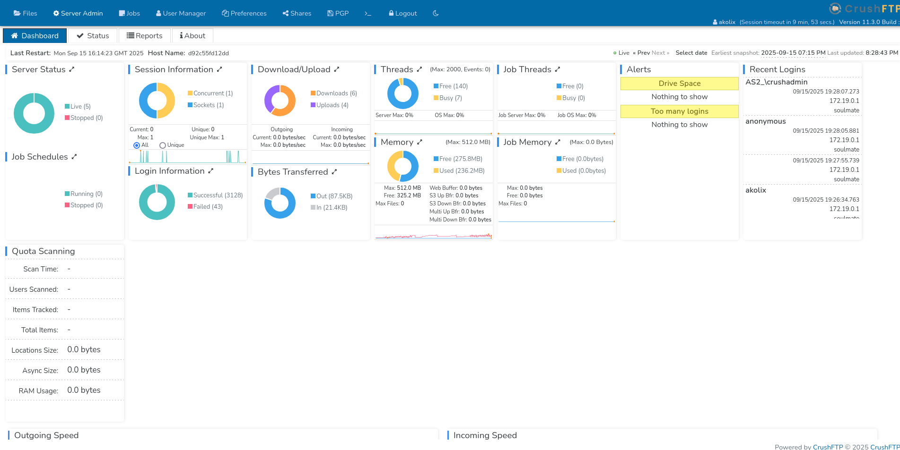
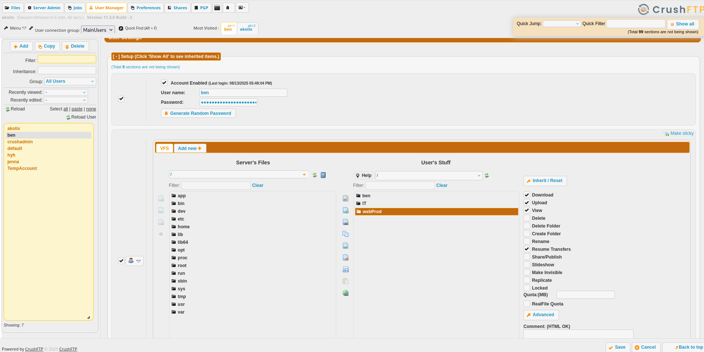
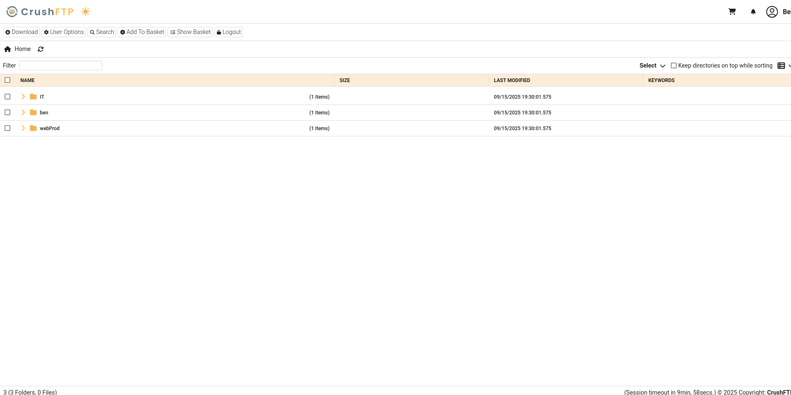

**Soulmate** is an **easy** rated room on **HackTheBox**
Without further ado, let’s begin.

>[!danger] 
>Don’t forget to add soulmate.htb to your /etc/hosts.

# 1. Initial Reconnaissance and Scanning:
### Nmap Scan:
Use Nmap to scan the target's open ports, services, and versions:

```console
nmap -sV -A <Target_IP>

``` 

### Understanding the Results:
We found :

●**Port 22** (SSH): Useful later for remote access.  
●**Port 80** (HTTP): Likely indicates a website is running.   

# 2.Enumeration :

With **port 80 (HTTP)** open, it's time to explore the website for hidden vulnerabilities or clues. This includes both manual inspection and automated enumeration of directories.

### Looking for subdomain:

During enumeration, we identified a subdomain named ftp


Navigated to ftp.soulmate.htb


Looks like the system is affected by CVE-2025-31161.

●**CVE-2025-31161** Immersive-Labs-Sec/CVE-2025-31161: Proof of Concept for CVE-2025-31161
: [link](https://github.com/Immersive-Labs-Sec/CVE-2025-31161)

```bash
python cve-2025-31161.py --target_host ftp.soulmate.htb --port 80 --target_user root --new_user akolix --password akolix
```


We were able to log in using the newly created user account.

Next, we moved to the Admin section to explore available options.


Let’s check out User Management.



Found a user called ben — looks worth checking out.


Looks like ben can upload files — interesting 😊



Let’s set a new password for ben and log in.


Let’s check out the webProd directory.



# 3. Gaining Access

### Uploading a Reverse Shell:

Let’s upload a file now.


Uploaded MonkeyPenstest’s reverse shell to establish a connection.

**Pentestmonkey’s PHP reverse shell**: [link](https://github.com/pentestmonkey/php-reverse-shell/blob/master/php-reverse-shell.php) 


Configured a listener on port 1339 with Netcat to catch the reverse shell.


Let’s go to soulmate.htb/rev.php to check it out.

Bingo! We’re in.


Found start.escript in /usr/local/lib/erlang_login and i found creds!


Let’s connect as ben now.


# 4. Privilege Escalation

Let’s see which ports are open and what services are running — check for any conflicts.
Looks like port 2222 is running Erlang SSH.
Looks like root ran a login script before.


Let’s connect as ssh-runner now.


Opened the help menu to see how to work with ssh-runner.


i ran os:cmd("id") as the ssh_runner user.


## Conclusion

The Soulmate machine provided a straightforward path for practicing both web enumeration and privilege escalation on a Linux system. By carefully exploring the exposed services and subdomains, we identified a vulnerable FTP web service and exploited CVE-2025-31161 to create a new user. This initial foothold allowed us to explore the web application further, identify users with higher privileges, and upload a reverse shell to gain system access.

Once inside, further enumeration revealed credentials and an Erlang SSH service running on a non-standard port (2222). Leveraging these, we were able to escalate privileges and gain access as a more powerful user.

This box highlights the importance of:

● Comprehensive enumeration (ports, subdomains, users).

● Understanding known vulnerabilities and using public exploits safely.

● Leveraging weak configurations for privilege escalation.

In summary, Soulmate is an excellent exercise in combining web exploitation with post-exploitation enumeration, demonstrating the step-by-step process from initial access to root/user privilege escalation.